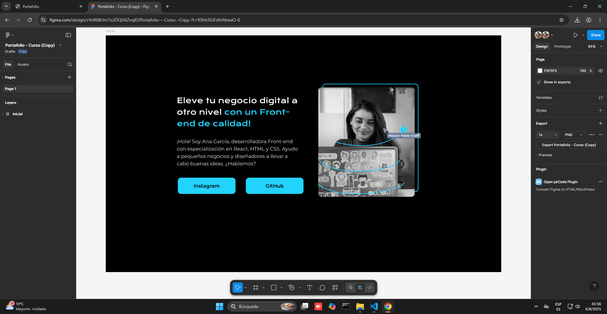
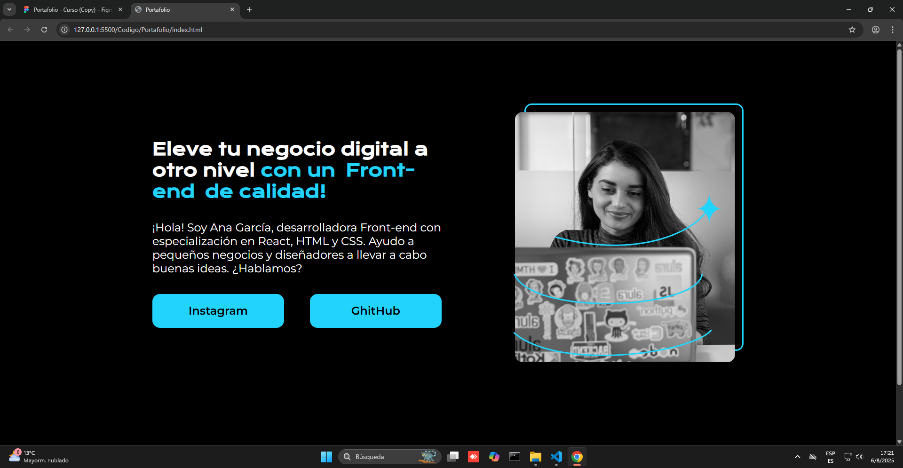

# Portfolio_V1.0_AluraLatam_ONE 🎨💻

Este proyecto es una práctica de conversión de diseño a desarrollo, donde trasladé una **plantilla visual creada en Figma** a un **sitio web real y funcional** utilizando HTML y CSS puros.

---

## 🛠️ Descripción del Proyecto

El objetivo principal fue construir una **versión inicial de un portfolio personal** aplicando buenas prácticas en el desarrollo front-end. Para ello, partí desde un diseño elaborado en Figma (ver Imagen 1) y lo transformé en código, cuidando la estructura, la semántica y el estilo visual (ver Imagen 2).

📌 **Imagen 1** – Diseño original en Figma  
📌 **Imagen 2** – Versión desarrollada con HTML y CSS

---

## 🎓 Contenidos Aplicados (Curso Oracle Next Education / Alura Latam)

Durante este proyecto puse en práctica los conocimientos adquiridos en el curso de **HTML y CSS**, donde aprendí a:

- 📦 Descargar e instalar un entorno de desarrollo web (VSCode, extensiones y configuración básica)
- 📚 Estudiar nuevas tecnologías a partir de la **documentación oficial**
- 🧱 Crear un proyecto desde cero con estructura de carpetas organizada
- 🎨 Aplicar estilizaciones con CSS para lograr coherencia visual y usabilidad
- 🔍 Entender la importancia del **HTML semántico** y seguir buenas prácticas de codificación

---

## 📂 Estructura del Proyecto

```plaintext
Portfolio_v1.0/
├── index.html
├── css/
│ └── style.css
├── assets/
│ ├── img/
│ │ ├── figma.png
│ │ └── resultado.png
└── README.md
```
  
---

## 🌐 Tecnologías Utilizadas

- HTML5
- CSS3
- Figma (para el diseño base)
- VSCode (entorno de desarrollo)

---

## 📈 Lecciones Aprendidas

- La importancia de respetar la jerarquía visual y semántica del diseño original  
- Cómo organizar un proyecto de múltiples archivos con orden y claridad  
- Qué elementos HTML usar para mantener accesibilidad y buenas prácticas  
- Cómo estudiar tecnologías web de forma autónoma y guiada por la documentación

---

## 🙌 Agradecimientos

Gracias al equipo de **Oracle Next Education** y a **Alura Latam** por la formación brindada, y especialmente a mi tutora **@barbara.santos**, por su acompañamiento constante y motivador durante este proceso.

---

## 📸 Vista Previa

**Diseño Original (Figma):**  


**Resultado Final (HTML + CSS):**  


---

## 🚀 Próximos pasos

- Un **header** completamente funcional con **navegación** entre secciones.
- Un **footer** informativo con enlaces relevantes y diseño responsive.
- Ajustes en la estructura y estilización para mantener buenas prácticas de HTML y CSS.

---

## 📬 Contacto

¿Te interesa colaborar o tenés sugerencias?  
Podés encontrarme en [LinkedIn](https://www.linkedin.com/in/hector-pablo-graff/) o dejar un issue en este repositorio.

---
